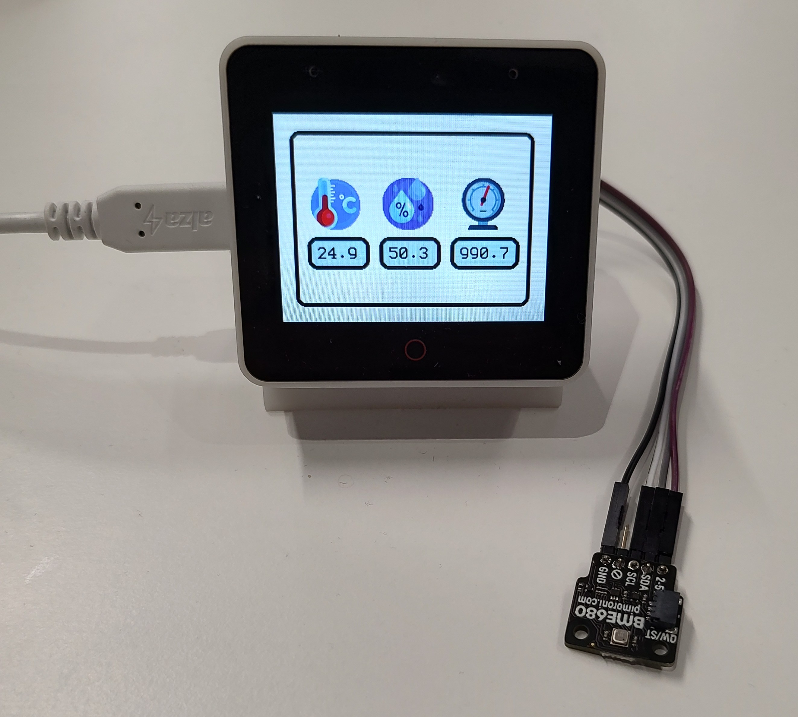

 

  

<h3 align="center">Display sensor data (and some other things)</h3>

  

    This project focuses on displaying data captured by the <a href="https://shop.pimoroni.com/products/bme680-breakout?variant=12491552129107"> BME680 sensor </a> on <a href="https://github.com/espressif/esp-box/"> ESP32-S3 Box </a>
  

## Current stage of development

Apart from displaying sensor data on the screen and updating it every 10 seconds, the program can:
  <li> connect to the wifi using <a href="https://github.com/esp-rs/esp-wifi">esp-wifi</a></li>
  <li>create a tls session using <a href="https://github.com/esp-rs/esp-mbedtls">esp-mbedtls</a> with successful connection</li>
  
<h3> All that using no_std Rust!! </h3>
  
Some functionalities will be separated to their own repositories in the future.

## Endgoal

Sending sensor data to AWS IoT Core for further analysis.

## WIP

<li>lightweight MQTT in no_std Rust</li>

(<a href="#readme-top">back to top</a>)

